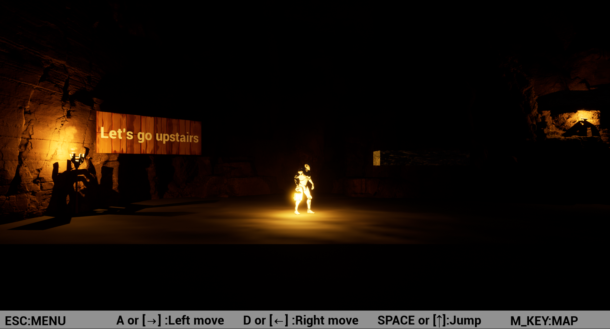

# Portfolio

- 大嶋 柊哉
    - 連絡先 Twitter [@wYtCmZYy0RAkyTJ](https://twitter.com/wYtCmZYy0RAkyTJ) / Email [oshima.dat22@gmail.com](mailto:oshima.dat22@gmail.com)
- 専門学校デジタルアーツ東京 ゲームプログラムコース 2024年卒業予定

## 資格
- 計算技術検定3級
- 情報技術検定3級

## スキル
- C#
  - 利用歴1年
  - Visual Studioで独自のツールの作成が可能
- Unity
  - 利用歴1年
  - オリジナルの個人ゲーム開発経験あり
- C/C++
  - 利用歴1年
  - コンソールで簡単なデータ処理プログラムを開発

## 取り組んでいるテーマ
1. オリジナルゲーム開発(横スクロール以外のジャンル)
2. チーム制作(CaveEscape)

## 作品リスト

### CaveEscape

[3D横スクロールアクション] 地下最深部に落ちてしまい、脱出のため登っていくゲーム

- 開発環境 Unreal Engine 4
  
### SHOOTER

[3D横スクロールアクション] 敵の弾を避けて攻撃し、進んでいくゲーム

- 開発環境 Unity
- 開発期間 2～3カ月
- ほぼ完成に近い状態

## 連絡先
- ブログ [oshima27](https://oshima27.hatenablog.com/)
- Twitter [@wYtCmZYy0RAkyTJ](https://twitter.com/wYtCmZYy0RAkyTJ)
- E-mail [oshima.dat22@gmail.com](mailto:oshima.dat22@gmail.com)
